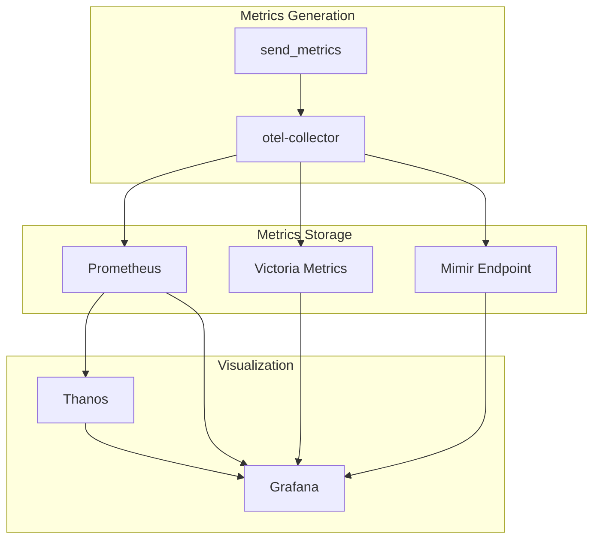
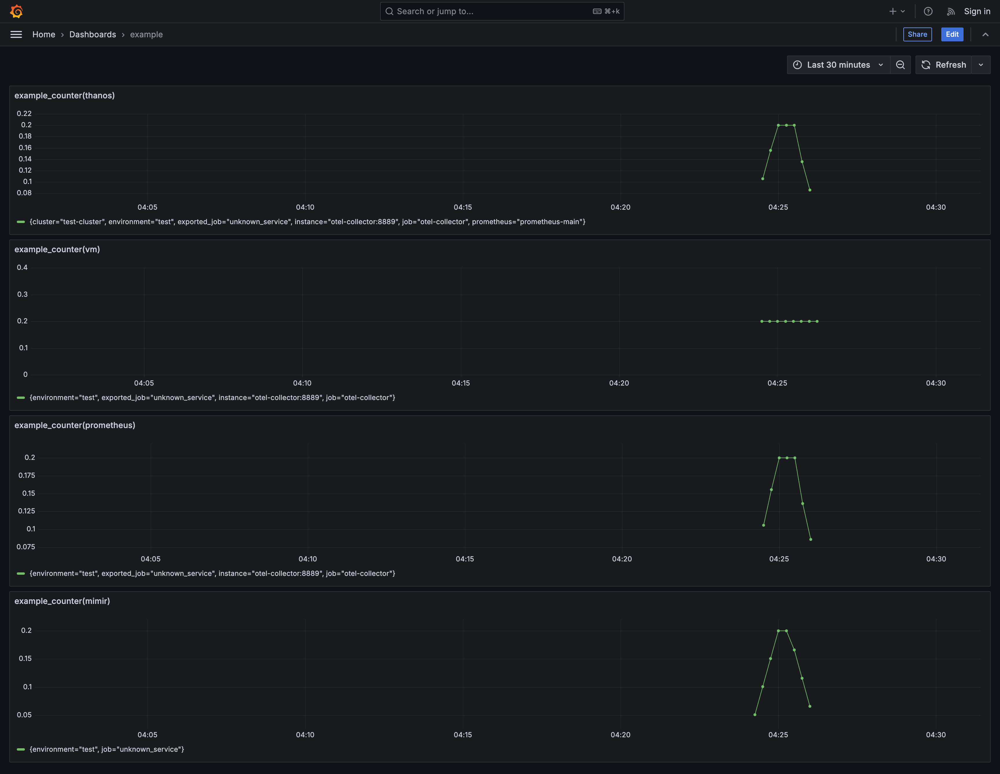

# storage-tests Documentation

## Overview

The `storage-tests` project is designed to test various storage solutions and visualize metrics using tools like OpenTelemetry, Prometheus, Grafana, VictoriaMetrics, and Grafana Mimir. The project utilizes containerized services orchestrated with Docker Compose.

---

## Project Structure

```
.
├── README.md
├── app
│   ├── Dockerfile
│   ├── requirements.txt
│   └── send_metrics.py
├── docker-compose.yml
├── grafana
│   ├── dashboard_provisioning.yaml
│   ├── dashboards
│   │   └── example.json
│   └── grafana-datasource-config.yaml
├── mimir
│   └── mimir.yaml
├── otel-collector
│   └── otel-collector-config.yaml
├── prometheus
│   └── prometheus.yml
└── vm
    └── promscrape.yml
```

---

## Architecture



## Key Components

### 1. OpenTelemetry Collector

The OpenTelemetry Collector collects and exports telemetry data. It is configured via `otel-collector-config.yaml`:

- Receives metrics via gRPC and HTTP (OTLP protocols).
- Exports metrics to Prometheus and Grafana Mimir.

**Config File:** `otel-collector/otel-collector-config.yaml`

**Key Receivers:**
- `otlp` for gRPC and HTTP.

**Key Exporters:**
- Prometheus (`prometheus/prometheus`)
- Grafana Mimir (`otlphttp/mimir`)

### 2. Prometheus

Prometheus collects and stores metrics from the OpenTelemetry Collector.

**Config File:** `prometheus/prometheus.yml`

- Scrapes metrics from `otel-collector` at `otel-collector:8889`.

### 3. VictoriaMetrics

VictoriaMetrics serves as an alternative storage for metrics.

**Config File:** `vm/promscrape.yml`

- Scrapes metrics using the configuration in `promscrape.yml`.

### 4. Grafana

Grafana visualizes metrics using dashboards.

**Key Files:**
- `grafana/grafana-datasource-config.yaml` (datasource configurations)
- `grafana/dashboard_provisioning.yaml` (dashboard provisioning)
- `grafana/dashboards/example.json` (example dashboard configuration)

### 5. Grafana Mimir

Grafana Mimir provides long-term storage for Prometheus metrics.

**Config File:** `mimir/mimir.yaml`

---

## Docker Compose Setup

The `docker-compose.yml` file orchestrates the services. Key services include:

### Services

- **otel-collector**
  - Collects and exports telemetry data.
  - Ports:
    - `4317`: OTLP gRPC
    - `4318`: OTLP HTTP
    - `8889`: Prometheus

- **prometheus**
  - Scrapes metrics from `otel-collector`.
  - Port: `9090`

- **victoria-metrics**
  - Alternative metrics storage.
  - Port: `8428`

- **grafana**
  - Visualizes metrics.
  - Port: `3000`

- **mimir**
  - Provides long-term storage for metrics.
  - Port: `9009`

- **metrics-sender**
  - Python application that sends example metrics.

### Networks and Volumes

**Networks:**
- `test-net`: Bridge network connecting all services.

**Volumes:**
- `mimir-data`, `vmdata`, `prometheus-data`: Persistent storage for respective services.

---

## Example Metric Sender

The `send_metrics.py` script sends example metrics using OpenTelemetry.

**Requirements:** `requirements.txt`

```plaintext
opentelemetry-api
opentelemetry-sdk
opentelemetry-exporter-otlp
```

**Key Features:**
- Sends a counter metric (`example_counter`) every 5 seconds.
- Metric is labeled with the environment (`test`).

---

## Visualization Dashboards

### Example Dashboard

- Displays metrics from Prometheus, VictoriaMetrics, and Grafana Mimir.
- Example panels visualize `example_counter` rate.

**File:** `grafana/dashboards/example.json`

---

## Getting Started

1. Clone the repository.
2. Build and run the services:
   ```bash
   docker-compose up --build
   ```
3. Access services:
   - Grafana: `http://localhost:3000`
   - Prometheus: `http://localhost:9090`
   - VictoriaMetrics: `http://localhost:8428`

Example Grafana dashboard:
